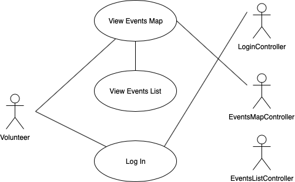

## Lab1
Course: Messiah College CIS 411, Fall 2018 Instructors: [Joel Worrall](https://github.com/tangollama) & [Trevor Bunch](https://github.com/trevordbunch) Name: David Abraham GitHub: [da1238](https://github.com/da1238) 

## Step 1: MVC Architecture**

| **Use Case #1**       |                                                                                                         |
|---------------------|---------------------------------------------------------------------------------------------------------|
| Title               | Find a service event                                                                                    |
| Description / Steps | The user opens the app and a map of the closest service events to his location are presented to him/her |
| Primary Actor       | The user (volunteer)                                                                                    |
| Preconditions       | 1. The user is signed in. 2. The user’s location is registered to the system.                           |
| Postconditions      | The system produces a list of available service events in the user’s vicinity                           |

| **Use Case #2**       |                                                                                                         |
|---------------------|---------------------------------------------------------------------------------------------------------|
| Title               | More information on service events                                                                                   |
| Description / Steps | The user taps on an event from the list to view more information on it. |
| Primary Actor       | The user (volunteer)                                                                                    |
| Preconditions       | 1. The system produced a list of the closest service events based on the user’s location                        |
| Postconditions      | The user is presented with more information on the service event                        |

| Model           | View           | Controller           |
|-----------------|----------------|----------------------|
| LoginModel      | LoginView      | LoginController      |
| SignUpModel     | SignUpView     | SignUpController     |
| EventsListModel | EventsListView | EventsListController |
| EventsMapModel  | EventsMapView  | EventsMapController  |

****

## Step 2: Enhancing an Architecture**

**Rails Architecture**: This architecture will be suitable as it will allow for serve central to be able to query and receive date from its model/datastore. It also accounts for the already established models, views and controllers and third-party services involved in the processes. A downside would be efficiency due to the dataflow with this architecture which is necessary due the fact that data is going in and out of the datastore.

## Step 3: Scaling an Architecture**

1.  Consuming bursts of 10k+ new volunteer opportunities per hour with a latency of less than 15 seconds between submitting an opportunity and its availability in the registration service.

**Layer Architecture**: This architecture will be appropriate to the dynamic nature of the situation. Due to the data on the datastore rapidly changing, the layer architecture allows these updates to be implemented at an equal pace due to the datastore's position on the data flow.

1.  Supporting a volunteer and event data store that will quickly exceed 50TB of data

**Master-slave**: For quick implementation, this architecture allows for flexibility when it comes to an excess in storage capabilities.

1.  Allowing authorized parties to issue queries that traverse the TB's of data stored in your datastore(s).

**Client-Server**: Because this architecture makes users aware of data authority, it'll be appropriate to implement in order query datastores that require certain permissions.

1.  Enabling researchers to examine patterns of volunteer opportunities as a way of determining future grant investments.

**Peer-to-peer**: Decentralized control allows for multiple users of the program/application to access analytics.

Changes to the architecture are required in order to alter the ways in which dataflows in a particular project in order to adapt for different stages. In situations where a system architecture does not match with its developmental stage, it may result in efficiency problems and hence low performance results.
